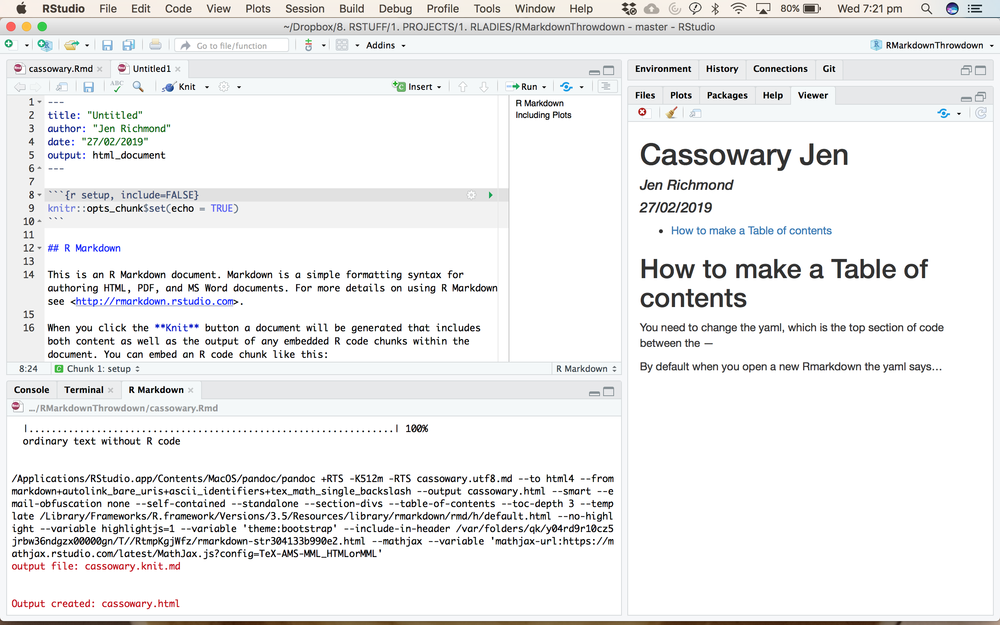
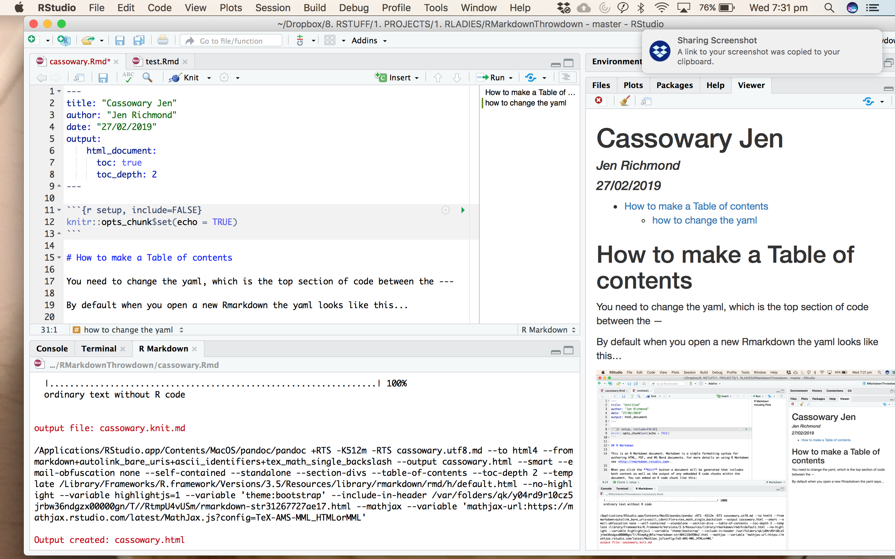

Cassowary Jen
================
Jen Richmond
27/02/2019

-   [How to make a Table of contents](#how-to-make-a-table-of-contents)
    -   [You need to change it so it looks like this...](#you-need-to-change-it-so-it-looks-like-this...)
    -   [how to change the yaml](#how-to-change-the-yaml)

How to make a Table of contents
===============================

You need to change the yaml, which is the top section of code between the sets of 3 dashes

By default when you open a new Rmarkdown the yaml looks like this...

### You need to change it so it looks like this...

how to change the yaml
----------------------

> BE CAREFUL, the indenting matters!

-   put the html output on a new line (indented) with a colon on the end
-   on another new line (indented), add toc: true
-   by default it will give the top 3 levels of heading, if you want fewer levels add another line that says toc\_depth: 2
