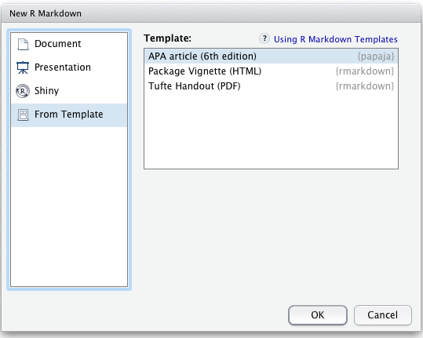

```{r setup, include=FALSE}
knitr::opts_chunk$set(echo = TRUE)
```

# Template notes

Our group looked at a few templates including from packages

* papaja [https://github.com/crsh/papaja](https://github.com/crsh/papaja)

* rticles [https://github.com/rstudio/rticles](https://github.com/rstudio/rticles)

* ireport [https://github.com/INWTlab/ireports](https://github.com/INWTlab/ireports)

The first two seem to be for academic reports while the third appears
to be for business reports. Another potential source is from

* [https://rmarkdown.rstudio.com/gallery.html](https://rmarkdown.rstudio.com/gallery.html)

Note that the academic reports one seems to need some form of LaTex package
installed. Options include

* Miktex for windows/mac/linux [https://miktex.org/](https://miktex.org/)

* Mactex for mac [http://www.tug.org/mactex/](http://www.tug.org/mactex/)

* tinytex windows/mac/linux [https://yihui.name/tinytex/](https://yihui.name/tinytex/)

The last of these seems to require the least downloads.
You will need to follow the instructions to install each
of these software packages.


Once these packages are installed they will appear from the ``From Template``
option when creating a new markdown file (see below, for example).


# APA template

Go to the link

[https://github.com/crsh/papaja](https://github.com/crsh/papaja)

```{r eval=FALSE}
# Install devtools package if necessary
if(!"devtools" %in% rownames(installed.packages())) install.packages("devtools")

# Install the stable development verions from GitHub
devtools::install_github("crsh/papaja")

# Install the latest development snapshot from GitHub
devtools::install_github("crsh/papaja@devel")
```

* Create a new R markdown file.

* Select ``From Template``

<center>

</center>

* Save, knit and bask in glory.

<center>

</center>
