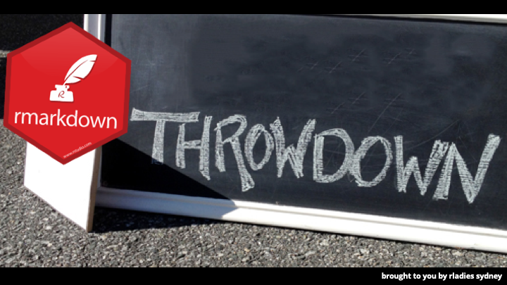
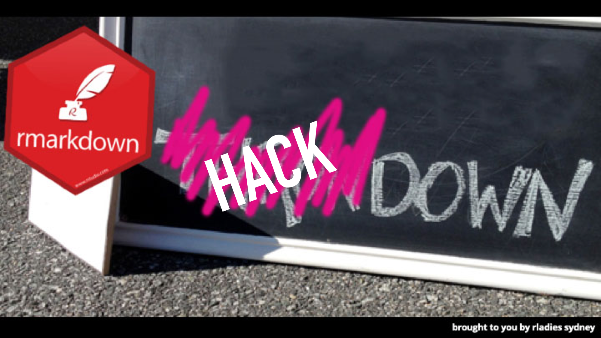

```{r setup, include=FALSE}
knitr::opts_chunk$set(echo = TRUE)
```

# Headings

You can make levels of heading in RMarkdown documents using hash

# One hash for really big headings
## Two hash for smaller
### Three for even smaller
#### So on and so forth


#Bold and Italics 
You can also make things bold and italics using asteriks on either side of the text. Use two asterisk for bold and 1 asterisk for italics. 


**I want this to be bold**

*I want this to be italics*

# Bullet points

You can also make bullet points with dashes. 

- bullet 1
- bullet 2
- bullet 3

Don't forget to put a space after the dash. 

#Quotes 

You can get quotes to be indented and nicely formatted using > 

> there is no such thing as a silly question

#Links

You can insert links with a combination of round and square brackets. Put the text in square brackets and the url in round brackets

The resources for RMarkdownThrowdown will be available at [Jen's github](https://github.com/jenrichmond/RMarkdownThrowdown)


#Pictures/gifs/tweets

You can embed all kinds of things in RMarkdown 


### Picture use  `` to add pics from your working directory 




### Tweets use the embed code

<blockquote class="twitter-tweet" data-lang="en"><p lang="en" dir="ltr">I'm seriously tired of explaining to white cis males that are AWARE of gender inequalities in technology WHY groups as the R-Ladies/pyladies are needed. Tired of the "these girls are discriminating us, they want to create more segregation" argument ????
?????? Just tired. <a href="https://twitter.com/hashtag/rladies?src=hash&amp;ref_src=twsrc%5Etfw">#rladies</a> <a href="https://twitter.com/hashtag/rstats?src=hash&amp;ref_src=twsrc%5Etfw">#rstats</a></p>&mdash; Bruna Wundervald (@bwundervald) <a href="https://twitter.com/bwundervald/status/1100100006957207553?ref_src=twsrc%5Etfw">February 25, 2019</a></blockquote>
<script async src="https://platform.twitter.com/widgets.js" charset="utf-8"></script>


### Gifs use the embed code

<iframe src="https://giphy.com/embed/2UBjBFCyJnWTQZ6NKY" width="480" height="480" frameBorder="0" class="giphy-embed" allowFullScreen></iframe><p><a href="https://giphy.com/gifs/bublywater-wow-thank-you-neil-patrick-harris-2UBjBFCyJnWTQZ6NKY">via GIPHY</a></p>


# What about code?

You can intersperse notes and code "chunks". R will publish everything in the document as text etc and run the code in each chunk. 

Add chunks using the Insert pull down, or use hotkey Ctrl-Alt-I. You can run each chunk of data by pressing the green arrow, or using the same shortcuts you would if you were running code in a script (Ctrl-Shift-Enter)

Play around with chunk settings using the cog


```{r message=FALSE, warning=FALSE}

library(tidyverse)

```

```{r}
beaches <- read_csv("sydneybeaches.csv")
```


What happens if we knit that?? It puts code in grey and output in white boxes and everything else is text. 

# Can we do graphs? YES

```{r}
beaches %>%
  group_by(Site) %>%
  summarise(meanbugs = mean(`Enterococci (cfu/100ml)`, na.rm= TRUE)) %>%
  ggplot(aes(x= Site, y= meanbugs)) +
  geom_col() +
  coord_flip()
```

Looks like swimming at Malabar is not a good idea...


# Export formats

The default export format is to html, but you can export to pdf or word by choosing from the pull down menu. Watch out pdf is finickity. You need to have some LaTex (pronounced Lah-Tech) thing also installed. 

Try...

`install.packages("tinytex")` 

# OK what next...

